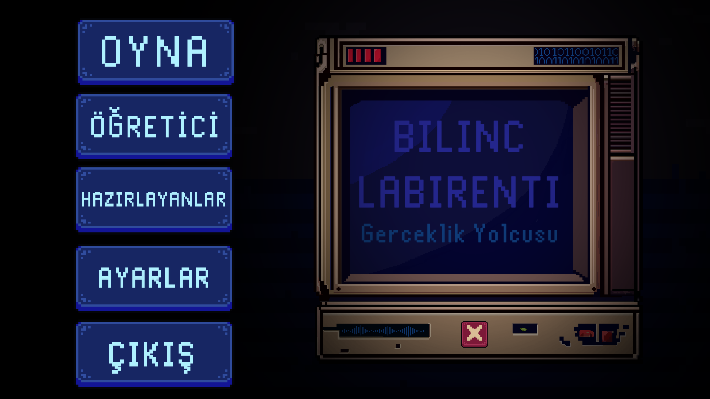
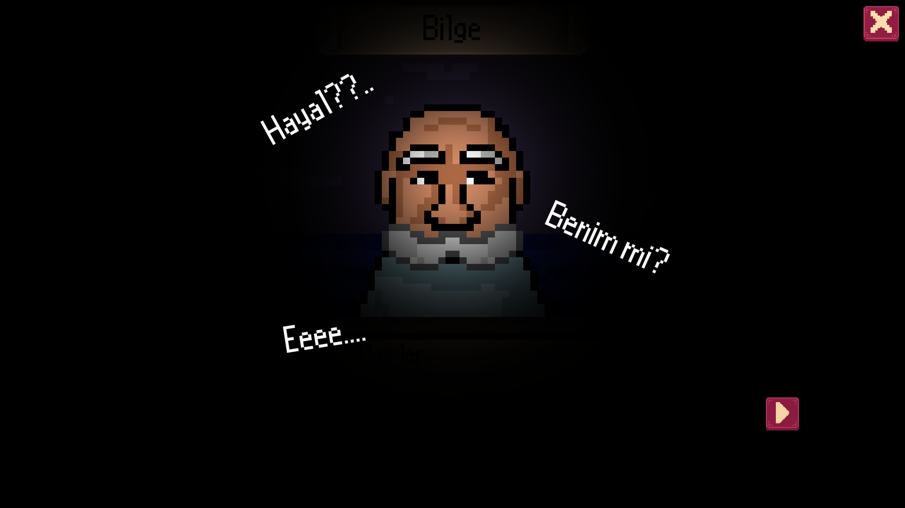
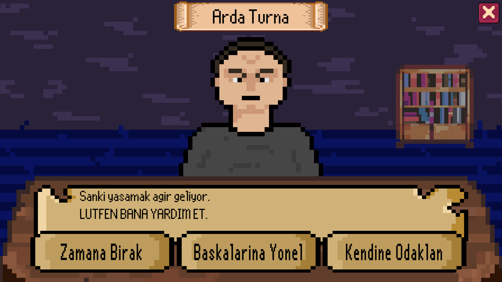

# 🎮 [Bilinç Labirenti : Gerçeklik Yolcusu - Text-based]

> 🕒 Developed in **November 2023**.  
> ⌛ Developed in **3 days**.

---

## 🧠 Concept

This game was developed for **Magara Jam 2023**.  
Theme: **"Mysterious machine(Gizemli makine)"**

Theme adaptation: The theme is conveyed through the in game story.

---

## 🕹️ How to Play?

1. Controls:  
   - By simply clicking.
2. Objective:  
   - The player must respond to the problems that appear by choosing from the available options.  
   - **Warning:** If you click any button before all the text is displayed, the game will bug out.
3. Language  
   - Turkish

🎯 **Goal:** Reach the end of the game by making choices.

---

## 🧑‍💻 Team

| Name | Section |
|-----------|--------|
| **Alperen Canbaz** | Programmer, Game Manager |
| **Radin Torabi** | 2D Artist |
| **Emirhan Altıntaş** | Story Writer|

---

## 💻 Technologies

| Category | Tools |
|-----------|--------|
| **Game Engine** | Unity |
| **Programming Language** | C# |
| **Assets Used** | No pre-made assets were used. |

---

## 📷 Screenshots

<p align="center">
  
  
  
</p>

---

## 🚀 How to Run

```bash
# 1. Go to the itch.io page
https://alperen-canbaz.itch.io/bilin-labirenti-gereklik-yolcusu

# 2. Download and run the game
